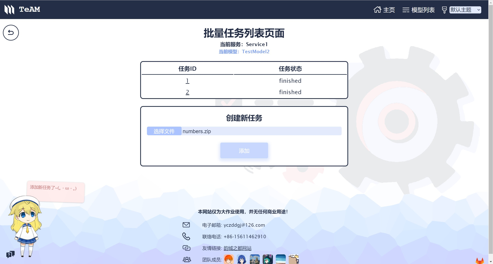

## 机器学习模型服务 大作业文档

**组长：**

​	软件02班 郭心源 2020012369

**组员：**

​	软件02班 谢苑瑜 2020080101

​	软件02班 范骏捷 2020011593

​	软件02班 幸若凡 2020012365

​	软件03班 王麒杰 2020010971

​	软件01班 顾洋丞 2019010461

### 项目概况

**清华Git地址：**

​	https://git.tsinghua.edu.cn/xy-guo20/ml-model-manage-system

**Git提交情况：**

**总提交次数：313次**

### 人员分工

​	郭心源：搭建前后端基本框架、加入**PKL**格式的模型支持、协调小组工作、测试与汇总。

​	谢苑瑜：设计并实现**Vue**前端页面的显示、完成前端主题替换功能、完成前端**Live2D**小助手功能。

​	范骏捷：利用**Axios**实现前端向后端通信、实现自定义预处理脚本页面与相关功能。

​	幸若凡：加入**PMML**和**ONNX**格式的模型支持，准备测试用模型文件。

​	王麒杰：使用**MongoDB**实现后端数据库相关功能、完成对模型、服务、任务、预处理的查找与更新。

​	顾洋丞：完成**Flask**后端框架的进一步搭建、利用**Celery**与**Redis**实现服务的任务安排与处理。

### 前端设计

#### 前端地址

​	本项目采用Vue作为前端框架，前端运行的默认端口是8080。以本地测试举例，在浏览器输入“http://localhost:8080/”即可进入系统主页。

​	前端各个页面地址汇总见下表（MID是模型ID，SID是服务ID，TID是任务ID）：

| 页面名称           | 前端地址                | 页面说明                 |
| ------------------ | ----------------------- | ------------------------ |
| 主页               | /                       | 欢迎内容                 |
| 模型列表页面       | /model                  | 查看所有模型信息         |
| 模型上传页面       | /upload                 | 上传模型                 |
| 模型详细信息页面   | /model/[MID]            | 查看某一模型信息         |
| 模型测试页面       | /test/[MID]             | 测试某一模型             |
| 预处理文件载入页面 | /preprocess/[MID]       | 加载某一模型的预处理文件 |
| 服务列表页面       | /service/[MID]          | 管理某一模型对应的服务   |
| 部署接口页面       | /predict/[MID]/[SID]    | 测试某一服务             |
| 批量任务列表页面   | /batch/[MID]/[SID]      | 管理某一服务对应的任务   |
| 任务详情页面       | /task/[MID]/[SID]/[TID] | 查看某一任务信息         |
| 404页面            | 其他                    | 404错误页面              |

#### 页面构成

​	以**模型列表页面**举例，每个前端页面由四部分构成：导航栏、内容、页脚、Live2D小助手。

##### 导航栏

​	导航栏是页面上方的一个区域，显示了系统的Logo（三个斜放的正方形，形状类似卷积网络）、系统的名称（TeAM）、“主页”链接、“模型列表”链接、主题更换下拉选择框。

##### 内容

​	不同的页面包含着不同的内容，详见下文。

##### 页脚

​	页脚包含大作业团队的一些基本信息，包括电子邮箱、联络电话、友情链接、团队成员。页脚的右下角还有前往项目的清华Git的图标。

##### Live2D小助手

​	为了使用户第一次使用时得到更加清晰的指引，系统配备了一名Live2D“小助手”（见左下角）。当鼠标悬停在不同页面的不同区域时，小助手都会给出相应的提示信息。如果用户已经对系统的使用较为熟练或小助手造成了信息的阻挡，可以点击小助手左下角的按钮关闭。小助手的显示状态会保存到cookie中，这样如果小助手之前被关闭，则下次系统启动时，小助手仍然会处于关闭状态，直到再次点击按钮。

#### 页面详情

##### 主页

	

​	主页的内容主要是一些欢迎信息，以及一个“开始”按钮。点击该按钮可以进入系统，跳转到**模型列表页面**。

##### 模型列表页面

​	该页面的内容包含一张**模型总表**与**上传模型按钮**。模型总表显示了系统中目前已导入的模型的信息，包括模型名称、描述、类型、算法、上传时间。表中的每一行的末尾还有删除模型按钮，为了防止用户误触，鼠标悬浮时该按钮会抖动，并且需要双击后才可删除模型。

​	点击每一行的模型名称可以跳转到该模型对应的**模型详细信息页面**。

​	点击上传模型按钮可以跳转到**模型上传页面**。

​	该页面加载时，会向后端地址“/model”发送GET请求，后端会从数据库中获取模型列表页面所需的所有信息并返回。

​	删除模型时，会向后端地址“/model/[model id]”发送DELETE请求，后端会从数据库中删除指定模型的信息。

##### 模型上传页面

​	该页面的内容是一张表单，表单项包括了**模型名称**、**模型描述**、**模型类型**、**模型文件**，下方有一个提交按钮。

​	模型名称必须是一个非空字符串，如果未填写的状态下进行上传前端会弹窗提示错误。模型描述是可选的，可以是多行的文本，也可以选择留空。模型类型是一个下拉选择框，包含PMML、ONNX、PKL三项，用户必须选择其中一项。模型文件是一个文件选择框，并且只能上传用户在“模型类型”处选择的类型。

​	点击上传按钮时，前端会向后端地址“/model”以Form Data的形式发送POST请求，后端收到请求后，会尝试分析模型文件的信息，**若模型文件不合法，则会捕获到错误发送给前端。**会自动分配一个**“模型ID”**（从0开始的正整数），将模型文件保存至后端的models文件夹下，并改名为对应模型ID的名称（后缀不变），方便后续调用，同时会向数据库中添加记录。前端收到回应后，会跳转回**模型列表页面**。

​	用户点击左上角的返回按钮后，也会返回至**模型列表页面**。

##### 模型详细信息页面

​	在该页面加载时，前端会向后端地址“/model/[model id]”发送GET请求，后端从数据库中查找信息并返回给前端。系统会显示模型名称、模型类型、模型算法、上传时间、预处理项、模型描述。其中**预处理项**在初始时显示为无，需要用户后续上传。

​	第二个框则显示了该模型的所有输入变量和输出变量，以及对应的变量信息。由于不同格式的模型文件中变量的储存信息不同，因此有些字段可能无法从文件中获取。

​	下面的三个按钮点击后分别会前往**模型测试页面**、**服务列表页面**和**预处理文件载入页面**。

##### 模型测试页面

​	该界面加载时，前端会向后段地址“/model/[model id]”发送GET请求，获取当前的模型ID对应的模型名称和输入变量信息。

​	变量的输入有两种模式：**form模式**和**json模式**，点击当前模式右边的切换图标可进行切换。

​	当处于form模式下，系统会根据当前模型的输入变量生成对应的输入框（又分为文件输入框和文本输入框）。不同的变量类型对应着不同的输入框。

​	而在json模式下，用户可以直接以json格式输入数据（要输入文件可以将文件转换为base64编码）。

​	若用户想要清空当前的输入，可以双击垃圾桶图标。垃圾桶图标在鼠标悬浮时会抖动。

​	用户完成输入后，可以点击提交按钮。此时会判断用户输入的合法性（是否非空、是否是json格式），若不合法则报错。通过验证后会向后端地址“/model/[model id]/test”带着当前的输入数据以json格式发送POST请求。后端会根据数据库和模型文件实例化一个模型对象，对输入进行预测，并将结果返回给前端，在本页面的右边的输出框显示。

​	下图为form模式的文本输入框和json模式：

##### 预处理文件载入页面

​	由于数据类型的多变性，直接来自文件输入框的图片（或其他输入类型）可能不满足模型的输入格式。因此，必要时用户可以编写**自定义的预处理脚本**，并上传到预处理文件载入界面，载入的文件与模型的输入是绑定的。

​	该页面加载时，会向后端地址“/model/[model id]/preprocess”发送GET请求，获取当前模型的预处理信息，用户可以点击已载入的预处理文件来下载。也可以选择删除已有的预处理文件，这会向后端地址“/model/[model id]/preprocess”发送DELETE请求，删除当前的预处理文件。用户也可以在下方选择上传新的预处理文件预描述。点击上传后，系统会判断预处理文件是否为空，如不为空则会将预处理文件以Form Data的形式POST到后端地址“/model/[model id]/preprocess”，后端程序接收到文件后，会将相关记录添加到数据库中，同时保存该与处理文件到后端文件夹preprocesses文件夹下，文件名会被改为当前的模型ID，并记录文件路径。

​	在模型进行预测时（无论是模型测试，还是服务的快速返回接口和批量返回接口），系统会检查当前模型是否存在预处理文件，若存在则会将输入数据经过文件中的pre_process函数处理，然后再输入进模型。

##### 服务列表页面

​	服务列表界面会显示当前模型所对应的所有服务，包括服务名称、创建时间、服务状态、服务次数、平均响应时长、最大响应时长、最小响应时长。

​	该页面加载时，会向后端地址“/model/[model id]/service”发送GET请求，后端会遍历所有数据库中所有服务的记录和**所有响应的记录**，筛选出当前模型对应的服务和服务对应的响应，**计算服务次数、响应时长相关信息**，并返回给前端。

​	每一行信息的后面有删除服务按钮，双击后会向后端地址“/model/[model id]/service/[service id]”发送DELETE请求，后端会找到该服务，并将该服务相关的任务停止并删除，最后删除服务。

​	每一行的服务状态信息有一个状态切换的按钮，点击可以切换服务状态，这会向后端地址“/model/[model id]/service/[service id]”发送POST请求，并注明是暂停服务还是开始服务。暂停后的服务将不会接受预测任务。

​	下方可以用来添加新服务，输入新服务的名称，然后点击添加按钮，前端会检查服务名是否非空，而后向后端地址“/model/[model id]/service”发送POST请求，后端会为每个新创建的服务分配**服务ID**（从0开始的正整数），并利用Celery开始对应的服务，同时记录服务相关的信息到数据库中。

​	点击每一行的服务名称则会跳转到**部署接口页面**。

##### 部署接口页面

​	该页面提供一个在前端测试服务的**快速返回接口**的功能。在json输入框内输入合法的json输入串后，点击下方的提交按钮，就会向后端地址“/model/[model id]/service/[service id]/quick”**（快速返回接口）**以当前的json输入发送POST请求。后端接收到对应的POST请求后，会调用当前服务保存的模型进行预测。与模型测试页面不同的是，快速返回接口不会临时实例化一个模型进行测试，而是利用已经创建的服务内部的模型进行测试。运行完毕后，模型会像前端返回模型的输出，前端在右侧的输出框内显示结果。

​	该页面还提供一个**json输入转curl代码**的功能。在json输入框内输入合法的json输入串后，点击Curl代码右侧的向下的箭头图标，即可生成curl代码。curl代码可以在终端运行，方便生产环境的集成。为方便用户使用，点击复制图标还可以一键对curl代码进行复制，方便用户粘贴到终端。

​	页面右上角有“前往批量任务列表”按钮，点击该按钮可以跳转到**批量任务列表页面**。

##### 批量任务列表页面

​	该页面提供一个访问后端**等待返回接口**的功能。该页面提供**任务管理查看**的功能。页面加载时，会向后端地址“/model/[model id]/service/[service id]/task”发送GET请求，获取当前服务的所有任务以及对应的状态。任务的状态分为三种：waiting（等待调度）、running（运行中）、finished（已完成）。

​	用户可以选择上传文件来添加批量预测的任务，支持的文件格式包括csv和zip，其中csv用来支持文本输入，zip用来支持其他格式的输入，zip压缩包里支持图片文件或者npy文件（numpy二进制文件）。点击上传按钮后，会向后端地址“/model/[model id]/service/[service id]/task”以Form Data的形式发送POST请求。后端接收到文件后，会先根据文件的格式解码，处理成模型接受的数据，然后在服务的任务列表中添加一个异步任务。后端同时会分配一个**任务ID**（从0开始的正整数），返回给前端，前端可以立刻通过任务ID来查看任务的状态，而无需等待任务结束后才收到响应。

​	点击任务列表中的任务ID即可前往对应的**任务详情页面**。

##### 任务详情页面

​	该页面的功能主要是查看某一个任务的执行情况。页面加载时，会向后端地址“/model/[model id]/service/[service id]/task/[task id]”发送GET请求，后端会调用服务的接口来寻找指定的任务并返回给前端。如果任务状态为finished，则会以json格式显示任务结果，否则不会显示。

##### 404页面

​	当用户在浏览器输入了不属于任何一个页面的地址时，会进入404页面，此时用户可以从导航栏返回**主页**或者**模型列表页面**。

#### 主题功能

​	为了丰富用户的视觉体验，系统为前端页面提供了5套各具特色的UI主题，分别为：**默认主题**、**黑白主题**、**赛博朋克**、**掘金者**、**青山**。

​	用户可以从导航栏的右上角进行主题更换，目前使用的主题会被保存到cookie中，用户下次打开前端页面时主题的选择不会丢失。

​	主题功能对文本、控件、图标和图片生效。对于文本与空间，更换主题时会更改它们的CSS颜色值（或背景颜色）；对于图标，主题会对预先保存好的黑色图标进行CSS的filter处理，使其呈现出不同的契合主题的纯色；而对于图片，我们无法进行简单的动态颜色替换处理，因此我们为每个主题都保存了一套图片用于加载，包括主页图片、页面背景图片、页脚背景图片、404页面图片。

### 后端设计

#### 后端接口

​	本项目采用Flask作为后端框架，后端运行的默认端口是5000。以不同的请求方法访问后端的地址即可调用相应的Flask接口。后端接口采用**RESTful API**风格设计。其中请求成功返回状态码200，信息不存在则返回状态码404，其他错误会返回状态码406。

​	后端各个接口地址与请求方式汇总见下表（MID是模型ID，SID是服务ID，TID是任务ID）：

| 函数名              | 后端地址                              | 请求方法 | 接口说明       |
| ------------------- | ------------------------------------- | -------- | -------------- |
| getAllModels        | /model                                | GET      | 获取模型列表   |
| createModel         | /model                                | POST     | 创建模型       |
| getModelInfo        | /model/[MID]                          | GET      | 获取模型信息   |
| deleteModel         | /model/[MID]                          | DELETE   | 删除模型       |
| testModel           | /model/[MID]/test                     | POST     | 测试模型       |
| getPreProcess       | /model/[MID]/preprocess               | GET      | 获取模型预处理 |
| LoadPreProcess      | /model/[MID]/preprocess               | POST     | 加载模型预处理 |
| deletePreProcess    | /model/[MID]/preprocess               | DELETE   | 删除模型预处理 |
| getAllServices      | /model/[MID]/service                  | GET      | 获取服务列表   |
| createService       | /model/[MID]/service                  | POST     | 创建服务       |
| changeServiceStatus | /model/[MID]/service/[SID]            | POST     | 更改服务状态   |
| deleteService       | /model/[MID]/service/[SID]            | DELETE   | 删除服务       |
| quickPredict        | /model/[MID]/service/[SID]/quick      | POST     | 快速返回接口   |
| batchPredict        | /model/[MID]/service/[SID]/task       | POST     | 等待返回接口   |
| getAllTasks         | /model/[MID]/service/[SID]/task       | GET      | 获取任务列表   |
| getTaskInfo         | /model/[MID]/service/[SID]/task/[TID] | GET      | 获取任务信息   |

#### 数据库设计

​	为了精简后端接口的实现，后端单独将数据库相关的操作从后端接口分离出来。后端接口通过调用数据库操作来关系模型、预处理、服务的数据。数据库操作只负责保管模型、预处理、服务的相关静态信息，例如名称、描述、文件路径等。因此，任务的相关实现不被包含在数据库中。本项目采用MongoDB作为后端数据库，可以使用docker来运行MongoDB应用，并暴露端口27017。

​	数据库由4个list组成：**模型list**、**预处理list**、**服务list**、**响应list**。

​	模型list存放模型ID、名称、描述、类型、算法、创建时间。

​	预处理list存放模型ID、文件名、描述、路径、类型。

​	服务list存放服务ID、名称、创建时间、状态、模型ID。

​	响应list存放每一次响应的服务ID、开始时间、结束时间、持续时长。

​	数据库相关函数设计如下表：

| 函数名             | 函数描述                               |
| ------------------ | -------------------------------------- |
| getAllModels       | 从模型list获取所有模型                 |
| getModelByID       | 从模型list查找指定ID模型               |
| addModel           | 添加模型到模型list                     |
| deleteModel        | 从模型list删除指定ID模型               |
| addPreProcess      | 添加预处理到预处理list                 |
| deletePreProcess   | 从预处理list删除模型ID对应的预处理     |
| getPreProcessByID  | 从预处理list获取指定模型ID对应的预处理 |
| getServicesByModel | 从服务list获取指定模型ID对应的所有服务 |
| addService         | 添加服务到服务list                     |
| setServiceStatus   | 在服务list中设定指定服务ID的状态       |
| deleteService      | 从服务list删除指定ID服务               |
| addResponse        | 添加一次服务响应到响应list             |

#### 模型数据结构设计

​	后端的模型数据结构采用Model类设计。Model类的作用是解析用户上传的模型文件、实例化为模型测试所需的模型、内置于服务的数据结构中被服务所调用。

​	模型初始化时，会根据模型的类型进行相应格式的初始化，并从模型文件中解析出输入变量、输出变量、算法等。

​	下表为成员变量及方法：

| Model类成员 | 类型           | 描述                             |
| ----------- | -------------- | -------------------------------- |
| model       | 变量（object） | 模型的核心对象，用于预测         |
| name        | 变量（string） | 模型的名称                       |
| des         | 变量（string） | 模型的描述                       |
| type        | 变量（string） | 模型的类型                       |
| algo        | 变量（string） | 模型的算法                       |
| time        | 变量（float）  | 创建时间                         |
| input       | 变量（list）   | 输入变量列表                     |
| output      | 变量（list）   | 输出变量列表                     |
| pmmlInit    | 方法           | PMML类型初始化                   |
| onnxInit    | 方法           | ONNX类型初始化                   |
| pklInit     | 方法           | PKL类型初始化                    |
| predict     | 方法           | 使用模型对象进行预测（带预处理） |

#### 服务与任务数据结构设计

​	除数据库保存的服务信息外，后端在内存里维护了一个服务列表，用于实现服务相关的操作。服务列表的元素为Service类的对象，可以根据服务ID获取、添加、删除指定的Service类对象。

​	模型的计算服务主要依赖Celery异步任务队列模块来实现任务的并发，其中的任务队列（broker和backend）依赖Redis数据库，部署时可以使用docker来运行Redis服务端，并暴露端口16379。在添加新服务时，会创建一个运行Celery Worker的子进程，并将它绑定到与该服务对应的任务队列。Service对象可以借助该队列来实现进程间的通信，分配具体的任务，进行异步计算，并最后获取计算结果。这里采用了不同的任务队列和不同的Celery Worker进程来确保不同服务之间的独立性。

​	Service类成员变量及方法如下：

| Service类成员 | 类型            | 描述                     |
| ------------- | --------------- | ------------------------ |
| model         | 变量（object）  | 服务内置的模型对象       |
| modelID       | 变量（int）     | 模型对象的ID             |
| pre_processer | 变量（dict）    | 模型输入预处理的相关信息 |
| id            | 变量（int）     | 服务ID                   |
| status        | 变量（bool）    | 服务状态                 |
| tasks         | 变量（dict）    | 储存所有的任务信息       |
| proc          | 变量（Process） | 服务对应的进程           |
| count         | 变量（int）     | 任务数量                 |
| predict       | 方法            | 使用模型进行快速预测     |
| batch         | 方法            | 创建新的批量任务         |
| getResult     | 方法            | 获取任务结果             |
| getTaskStatus | 方法            | 获取任务状态             |
| getTasks      | 方法            | 获取任务列表             |
| changeStatus  | 方法            | 改变服务状态             |
| close         | 方法            | 关闭服务                 |

### 参考链接

1. [Vue3 官方文档](https://cn.vuejs.org/guide/introduction.html)
2. [Vue Router 官方文档](https://router.vuejs.org/zh/)
3. [Flask教程 - W3Cschool](https://www.w3cschool.cn/flask/)
4. [Flask 官方文档](https://flask.palletsprojects.com/en/2.2.x/)
5. [Celery 官方文档](https://docs.celeryq.dev/en/master/index.html)
6. [Docker 官方文档](https://docs.docker.com/)
7. [scikit-learn 官方文档](https://scikit-learn.org/stable/)
8. [live2d-widget 官方文档](https://l2dwidget.js.org/docs/index.html)
9. [CSS filter滤镜任意色值转换工具](https://www.zhangxinxu.com/sp/filter.html)
10. [Noun Project 素材网站](https://thenounproject.com/)
11. [【CSDN】vue中图片转换为base64上传、预览、删除](https://blog.csdn.net/przlovecsdn/article/details/80337738)
12. [【CSDN】vue中formData方式上传文件](https://blog.csdn.net/qq_38543537/article/details/124942294)
13. [【CSDN】vue-cookies使用方法](https://blog.csdn.net/z591102/article/details/117961384)
14. [【简书】vue中axios的使用](https://www.jianshu.com/p/97f6b37638c8)
15. [【简书】自动部署PMML模型生成REST API](https://www.jianshu.com/p/552fa06415a5)
16. [【简书】使用ONNX部署深度学习和传统机器学习模型](https://www.jianshu.com/p/c1e0efe6482f)
17. [【知乎】Flask和Vue.js构建全栈单页面web应用](https://zhuanlan.zhihu.com/p/76588212)
